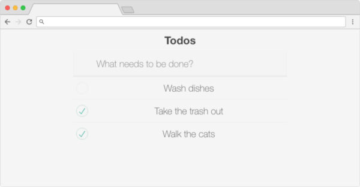

## Our Goal

With RxJS, we can create observables that allow us to listen for multiple values and manipulate streams of data. If we look at the data coming from the reducers of a redux store, it can be considered a stream of data that we are reacting to by updating our React view.

With Observables, not only can we implement the functionality that redux provides, we can easily extend it to include asynchronous actions that return a single piece of data or multiple values.

In this article, we will go over how to create a redux store without using redux — instead, we’ll use RxJS observables. We’ll make a simple Todo App that let’s you create items and mark them as completed.

## Getting Started

We’ll use [create-react-app](https://github.com/facebook/create-react-app) to quickly bootstrap the creation of a new app. And since this is an RxJS tutorial, we’ll need to install RxJS. We’ll also use Recompose to tie our RxJS and React together. Run `yarn add rxjs` recompose to install the dependencies we’ll use.

We also need to tell Recompose that we are using RxJS as our observable library. Create a file called **setupObservables.js** in the same directory as the **index.js** file.

```js
import { setObservableConfig } from 'recompose';
import { from } from 'rxjs';
setObservableConfig({
    fromESObservable: from,
    toESObservable: function toESObservable(stream) {
        return stream;
    },
});
```

We need to run this code before the rest of our code runs, so we’ll add an import for this file in the **index.js** after the absolute imports, but before the import for **App.js**.

## Creating The Store

In order to implement the features of redux, we’ll need a store that uses reducers to determine the state of our application. We’ll also need actions that will dispatch new data that our store will process.

Our RxJS store will consist of two things: a way to track the current state, and actions that can modify the state. We can use recompose to create the actions that our React app can perform on our store:

```js
const { handler: create, stream: create$ } = createEventHandler();
const { handler: toggleComplete, stream: toggleComplete$ } = createEventHandler();
```

The above code creates two event handlers that have a handler function that can be called, and an observable stream. Using that stream let’s us listen for data that comes in from the handler being called.

The next step is to merge those streams with a reducer that we will create later. We will merge the event handler streams after manipulating the data they are called with, similar to how we would define action creators in redux. After we merge the streams, we’ll use `startWith` to call the reducer to create the initial state, and we’ll use `scan` to create an accumulator to hold our state:

```js
import { merge } from 'rxjs';
import { map, scan, startWith } from 'rxjs/operators';
import { createEventHandler } from 'recompose';
import reducer from './reducer';
const { handler: create, stream: create$ } = createEventHandler();
const { handler: toggleComplete, stream: toggleComplete$ } = createEventHandler();
const todos$ = merge(
    create$.pipe(map(text => ({
        type: 'CREATE_TODO',
        data: {
            text,
        },
    }))),
    toggleComplete$.pipe(map(index => ({
        type: 'TOGGLE_COMPLETE_TODO',
        data: {
            index,
        },
    })))
)
    .pipe(startWith(reducer(undefined, { type: 'INIT' })))
    .pipe(scan(reducer));
export default {
    observable$: todos$,
    actions: {
        create,
        toggleComplete,
    },
};
```

## Creating the Reducer

You can write the same reducer as you can with redux as you can with RxJS. We’ll keep this one simple and just have two cases, create a todo and toggle a todo completion state.

```js
export default (state = {
    items: [],
}, action) => {
    switch (action.type) {
        case 'CREATE_TODO':
            return {
                ...state,
                items: [action.data, ...state.items],
            };
        case 'TOGGLE_COMPLETE_TODO':
            return {
                ...state,
                items: state.items.map((item, index) => {
                    if (index === action.data.index) {
                        return {
                            ...item,
                            completed: !item.completed,
                        };
                    }
                    return item;
                }),
            };
        default:
            return state;
    }
}
```

## Setting Up Your Component

Nothing special here, we just need some code in order to demonstrate our reducer is working.

```js
const App = ({ todos, onSubmit, onToggleComplete }) => {
  return (
    <div className="App">
      <form onSubmit={onSubmit}>
        <input type="text" name="text" />
      </form>
<ul>
        {todos.items.map((todo, i) => (
          <li key={i}>
            <input onChange={onToggleComplete(i)} type="checkbox" checked={todo.completed} />
            {' '}
            {todo.text}
          </li>
        ))}
      </ul>
    </div>
  );
};
```

## Wiring It All Together

Wiring up the RxJS store and our reducer is the magical part where everything comes together. Below, I have the actions and store state split into two different higher order components.

The `withHandler` takes care of mapping events to the actions from the RxJS+Recompose store.

The `withStore` is a bit more involved. We use the `mapPropsStream` that Recompose provides to take the props given to this component and turn them into a stream that we can manipulate. By using `combineLatest`, we can transform the props and add our store data:

```js
import { compose } from 'recompose';
import { mapPropsStream, withHandlers } from 'recompose';
import { combineLatest } from 'rxjs/operators';
import todos from './todos/store';
// ... App component
const withHandler = withHandlers({
  onSubmit: props => e => {
    e.preventDefault();
props.todosActions.create(e.target.text.value);
e.target.text.value = '';
  },
onToggleComplete: props => index => () => {
    props.todosActions.toggleComplete(index);
  }
});
const withStore = mapPropsStream(props$ => props$.pipe(
  combineLatest(
    todos.observable$,
    (props, store) => ({
      ...props,
      todos: store,
      todosActions: todos.actions,
    }),
  )
))
export default compose(
  withStore,
  withHandler
)(App);
```

By composing these higher order functions together, our App component now has the current state of the todo store and actions to manipulate that store. By thinking about the props as streams of data, we can easily combine streams and manipulate the streams to create our own data stores that are flexible and powerful.

<image-left>



What it looks like after being prettied up with [TodoMVC](https://github.com/tastejs/todomvc-app-css) styles

</image-left>

## Going Further

While you can keep your stores separate using this method, you can also merge your stores together, just like you can with redux. Since each store is just an observable stream, you can merge them and manipulate them just like any other stream.

Likewise, since your stores are just data streams, you can add other stores that listen to these streams that provide calculated values like averages, running totals, time differences, and more. For example, if we wanted to add on a calculated value of the number of completed todos, we would just write a new store that used our current todos observable:

```js
const completed$ = from(todos.observable$)
    .pipe(startWith(0))
    .pipe(scan((_, next) => {
        return next.items.filter(item => item.completed).length;
    }));
```

You can see a working example of the above code here in this [Github Repo](https://github.com/clarityhub/rxjs-recompose-react).
