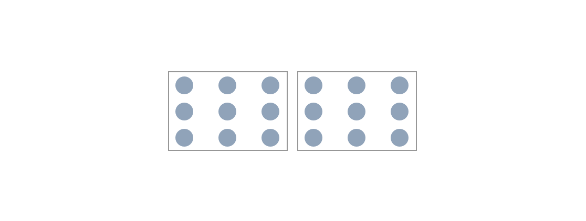
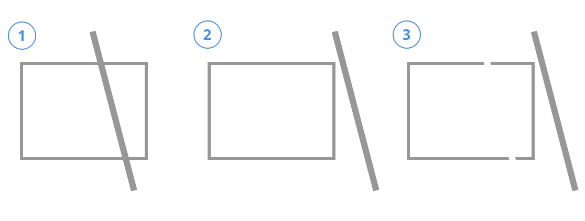

When creating user interfaces, it's important to understand how the interface will be interpreted by your end users. There are psychological foundations we can build upon when making design choices that we can embed and document without our design system.

<!-- end -->

In this article, we'll explore **cognitive load** and the **gestalt principles of design** as key concepts to consider when building your design system.

## Cognitive Load

Creating a design system is more than just creating components or picking colors. We need to consider how our components will be used together to provide intuitive experiences for our users.

People generally can hold around 4 to 5 bits of information at one time. Information we present should keep this in mind. Lists, dropdowns, button actions – our brains can easily be overloaded with information if we don't deliberately design these interactions.

> Working memory can only hold 4-5 bits of information at one time and information in working memory lasts only around ten seconds.

For example, select components often overload the user with too many options and no way to narrow them down. Providing typeahead or search would allow the user to narrow down results and reduce cognitive load.

**Key takeaway**: Try to minimize the size of lists, action groups, and other sets of information.

## Gestalt Principles

### Law of Proximity

Items that are physically close together will be considered as part of a group.

For example, in the following image, dots are spaced out in certain ways in order to create visual groupings:

By using different spacing, we can visually group dots into groups, rows, and columns.

**Key takeaway**: Make spacing and groupings a conscious decision when developing your Design System.

### Similarity

When giving two items that look similar, users will perceive them as being related or belonging to part of the same group.

This impacts our designs in two ways:

1. It makes it easier to train users on on our application works. For example, we can create different colored buttons, different button states, and different size buttons, and still have the all perceived as buttons by our users.
2. But it also means that components that look too similar, but are supposed to provide different purposes may be interpreted as belonging to the same group.

If an underline signals to the user that some text is a link, you cannot use that signal elsewhere to mean that text is important. We will talk about signals and affordances later in a later article, but similarity plays a key role in it.

**Key takeaway**: Using similarity as a pattern throughout your design system makes it easier on users to mentally group items together.

### Enclosure

Another way our minds group together items is through a concept called enclosure. By wrapping items in a visual container, users perceive the items to belong together.

Although the circles are spaced apart equally into columns, the two rectangles visually separate them into 2 distinct groups.

This concept can be used to create visual groupings throughout your application. Navbars, cards, sidebars, popup menus – these can all utilize enclosure to help the use understand that the items within these sections belong together.

**Key takeaway**: Use enclosure to draw visual distinctions in your design system.

### Closure

So far, the gestalt principles have focused on spacing and grouping. The closure principle helps us identify what we can take away from our designs.

Our brains will fill in gaps when parts of a whole are missing.

Although there are large gaps between the lines in the image above, our eyes still see a square.

Similarly, we can remove lines from tables, and our eyes will still visualize the data in a tabular format.

**Key takeaway**: Be aware of what you may be unnecessarily adding to a design. Closure may help you identify when you can remove elements from a design.

### Continuity

When looking at partially obscured objects, our eyes will fill in the missing details with smooth paths.

In the above image, a line partly obscured the rectangle behind it (1). Both a full rectangle (2) and a broken rectangle (3) are likely, but our eyes interpret the image to be a full rectangle.

When we create a design system, this principle will help us strip out unnecessary elements like the closure principle. If we wanted to align elements, we do not need to visually show a line; our eyes will naturally see a line when elements are aligned to it.

**Key takeaway**: Our design system can remove unnecessary visual indicators when our eyes will fill in the missing details.

### Connections

We tend to group items that are physically connected with each other.

In the above image, there are two boxes that are physically connected by sharing a side. To a user, they would visually form one group: a button and a dropdown that acts on that button.

Using connections in a design system can help indicate to users that visually distinct items are related. A timeline component, for example, might have text, icons, images, that are all related by a line that connects them.

**Key takeaway**: Use connections to show that visually distinct items are related.

## Conclusion

By keeping Gestalt principles in mind, we can develop a design system that implements best practices for showing users that items are related. This helps us keep the cognitive load of our users down and makes our applications more effective and enjoyable. By using spacing, similarity, enclosure, closure, continuity, and connections, we can create pleasing interfaces that do not frustrate or confuse our users.
