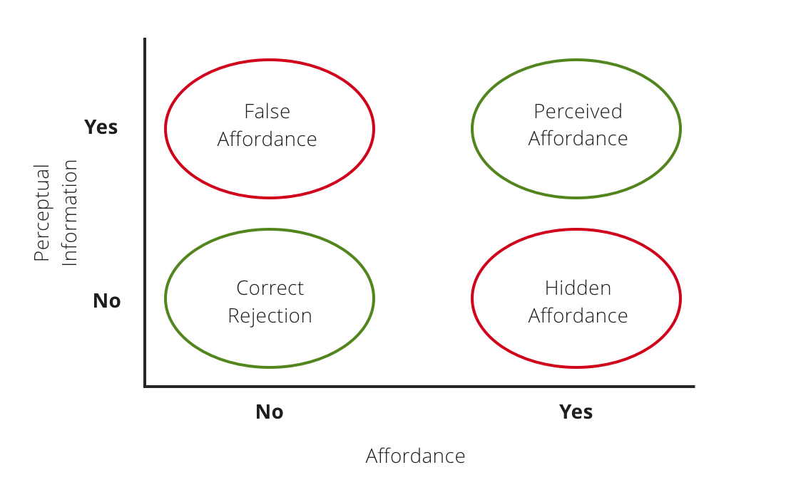

Design systems are made up of foundational styles, components, and patterns. By using the principles of affordances and signifiers, we can design effective elements for our applications that are easy to understand by our end-users.

<!-- end -->

## What are Affordances and Signifiers

**Affordance** is what an object/component *can* do. **Perceived affordances** is what we *think* something can do. The two often
get mistaken for each other, but as a designer, it's important to make sure that the gap between the two is as small as possible.

We use **signifiers** – signs indicated what you can do – to make perceived affordanced more inline with the actual affordances and object has.

<image-set>

Different categories of affordances.

</image-set>

For example, text on a page by iteslef does not provide any signifiers. Even though that text might have an affordance that takes users
to another page when they click on it, the user has no way of knowing that. We can signify that the text is a link by using standard web
signifiers that users have associated with links: an underline, color, and hover effects.

We can even stretch these signifiers as long as there are enough signals to a user that the text is still clickable. We could remove the underline
and instead use a highligher effect.

<image-set>

We can see the sliding scale of different types of links and how their signals help us perceive affordances.

</image-set>

## Developing Patterns

Component patterns arise when we consistently use signifiers to indicate the same afforances. If we consistenly use a certain color and hover effects, users will know that components that uses these signals are clickable. If we use a soft shadow around colored text and add a hover effect, the user will come to understand that these are buttons and that they are clickable, but do not direct them to a new site.

Making appealing design system requires that we consider how we will indicate different affordances. A button is a set of signifiers that we uise to express the affordance that it is clickable.

Our design system foundations starts by taking our styleguide and developing signifier patterns in order to create components that are easily usable by our end-users.

## Constraints in Web Design

When we create design systems for the web, we have to design within certain constraints since our applications may be used in a wide variety of situations.

Users may be using a desktop, laptop, mobile device, tablet, maybe even their television. They might be in direct sunlight, or it might be the middle of the night with no lights on. Users may even be haard of seeing, or have limited mobility, or a user might even be a "power-user" who doesn't like touching their mouse and uses keyboard shortcuts for most of their work.

The same signifiers that work in one situation may not even be possible in others. For those that use screen-readers, it doesn't matter if you used color, underlines, or hover-effects to signify that your text is a link – it doesn't help the end-user. Instead you have to make sure that you use the correct non-visible signifiers as well: correct mark-up, labels, and other aria attributes when applicable.

Using multiple signifiers and non-visual signifiers helps your design system be robust for the various scenarios that you be designing for and where your designs will be used.
