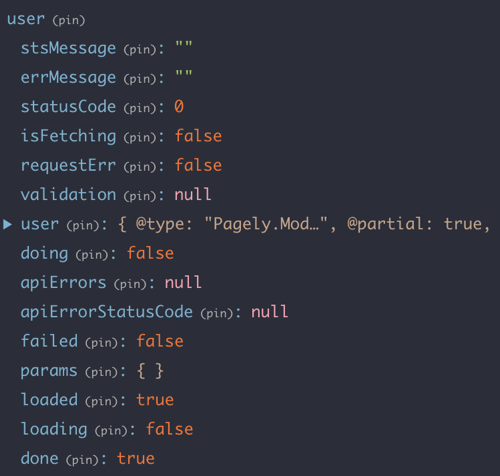

If you're still using Redux for global state management, you are likely using a promise-based approach to making network requests. However, to keep track of the state of the requests, you have to rely on clunky prop management to update components. A better way would be to optimize what data you need and leverage the power of promises at the component level.

<!-- end -->

## A Quick Intro to Redux

React has been out for a while now and the ecosystem has gone through a lot of experimentation. There are a lot of aspects to cover, but **global state management** – a store of information that lives outside of the component lifecycle – has been its share of iterations. Many frameworks have been developed, touted, and discarded, but through it all, **Redux** has come out as the de facto solution.

### Redux in a Nutshell

I’m not going to go into a full explanation of how Redux works, since there are already a ton of great articles about that. Redux is pretty simple in its implementation, and relies on only a few concepts; if you aren't familiar with them, you'll want to review them: The store, actions, reducers, and thunks. The important thing to note is that typically, actions will be dispatched multiple times from the thunk to keep track of the state of any asynchronous requests or API calls.

## Storing Data

Now, let’s go through a mental exercise on “Good UI”.

Suppose I have a button in my application that will “Add Users” to my team. What kind of things, as a user, am I interested in seeing?

1. I want to get feedback when something happened
2. I want to see a success state
3. I want to see a failure state
4. I want to see multiple success states - How many users did I actually add?
5. I want to see multiple failure states - The app is responding to my actions and not to a 3rd party failure

### Data Representations

How would we represent that in the redux store?

Well there are 4 options:

1. A single field: `success: true`
    * Not flexible enough to really work for pretty much any case
2. Two fields: `success: true`, `failure: false`
    * Better, but not ideal - might get conflicting states
3. A single string field - `status: "success"`
    * A great option, prevents conflicting states and can account for non-binary distinctions
4. Any of the above on each request

All of these have their strengths (except the first one), but suppose we make the request twice? Each scheme will be able to store different kinds of information

The case of guaranteed failure isn’t an uncommon one. It could be caused if there’s a validation error (failure/success), or if there’s an internal server error (failure/failure). In the first three schema cases, even if there are two requests (one successful), the store will only keep the state of the last request, regardless of real actions that took place. The implication is when you try to make two requests to create a user and the last resolves in a failure, the user will be misguided since one failure looks identical to two - though one user was still successfully created. The only model that can successfully convey this information to the UI is the last one, where each request is recorded. However, the drawback is that the store can become bloated with failed requests if they are not cleared out.

The case of a success then a failure isn’t uncommon either - This could be caused by rate limiting from the API, or from a race condition. Again we run into the problem of either over-persisting or under-persisting.

Now that we’re acquainted with all the intricacies of success and failure, there is one more states to consider: Loading State. What does loading data mean? Typically it means that what we’re looking at either is incomplete or transitioning. Since we can keep any data it all in the store, it makes sense to add this information also. Be careful with this though, as the store can quickly become bloated with transactional data (even more so than real data)



The problem is further compounded with connected components, which all update when the state updates, and must rely on clunky lifecycle methods. Basically, relying on synchronous execution of data handling and props is not a great way to manipulate the UI, not to mention that you frequently have to update the state in lifecycle methods that aren’t optimized for it. If you do "Redux cleanup" in your lifecycle methods, you can force your UI into a mismatched state when older components un-mounting override newer data from just-mounted components. If your component is watching several stores, its very easy to get into "prop hell". In general, relying on updated props to show success or error messages can become very messy, very quickly.

## Using Promises at the Component level

A simple solution to this is to return promises from the Redux actions, so that at the component level, functions can be chained to update component state. Instead of splitting up the logic for calling an action and then resolving its effect in lifecycle methods, the effects can be resolved as a promise chain (or even with async/await). Also, this gets away from having to call setState in lifecycle methods, which you shouldn't be doing anyway, and colocates state updates with the action that caused them.

> Redux is excellent at keeping track of data... but not for keeping track of how it got there.

Here's an example of what a promise-returning action creator might look like:

```js
export const makeApiAction = (
  callback, requestType, successType, failType,
  params = {},
) => (dispatch) => {
  const action = {
    type: requestType,
    params,
  };
  dispatch(action);

  return callback()
    .then((res) => {
      const data = res;
      dispatch({
        ...action,
        type: successType,
        data,
      });

      return new Promise((resolve) => resolve(data));
    })
    .catch((err) => {
      if (err.response) {
        switch (err.response.statusCode) {
          case 401:
            dispatch(logout());
            break;
          default:
            dispatch(Object.assign({}, action, {
              type: failType,
              error: err,
            }));
            break;
        }
      }
      throw err;
    });
};
```

And here's an example of what an action might look like:

```js
export const dispatchMFAReset = (data) => {
  return makeApiAction(
    () => request.post(‘/mfa/reset’, data),
    MFA.RESET_REQUEST,
    MFA.RESET_SUCCESS,
    MFA.RESET_FAILURE,
  );
};
```

Finally, in the component itself, use promises to update component state

```js
handleRequestReset = (e) => {
  e.preventDefault();
  const { dispatchMFAReset, token } = this.props;
  const { password } = this.state;

  this.setState({ status: 'loading' });
  dispatchMFAReset({token, password})
    .then(() => {
      this.setState({ status: 'success' });
    })
    .catch((err) => {
      this.setState({ status: 'error', err})
    })
}
```

### Closing Remarks

The ultimate goal is good user experience, and hopefully this makes it easier. It's hard to make Redux into a pure data tool, but using promises can help with cutting down how much transactional data needs to be stored. Instead focusing on the state of the action (success, failure, and loading), focusing on the state of the data (pristine, loading, ready) can be another step towards data-driven model design, since the action-driven data can be handled inside of the components initiating the action.

This probably isn't the perfect approach, but it carries some handy benefits. 
