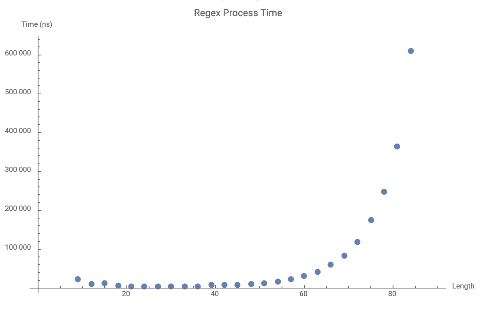

Let's say we wanted to validate that an email was in the correct format using a regular expression. We search online and find the following regular expression that someone provided on their blog:

```
/^([a-zA-Z0-9_\.\-])+\@(([a-zA-Z0-9\-])+\.)+([a-zA-Z0-9]{2,4})+$/
```

We copy it over and use it to test incoming strings to check if they are valid email addresses. We deploy it to production, but thanks to a tool like New Relic, we notice that the CPU utilization for the sign up service is abnormally high. One day, we notice that the service is returning status code 500: Internal Server Errors for every request. We've just succumbed to a Regular Expression DoS!

## Backtracking

So what's going on? Why would that regular expression kill our server?

Let's go in and see how long it's taking to run the regular expression code. I'm going to end up plotting the output, so that's why the output is a string:

```js
let output = [];

for (let i = 1; i < 30; i++) {
    const start = process.hrtime();
    const email = `${"a".repeat(i)}@${"b".repeat(i)}.${"c".repeat(i)}{`;
    validateEmail(email);

    if (i === 1) {
    // Throw out this one as it will normally take longer since the code
    // is running for the first time.
    continue;
    }
    output.push(`{${email.length}, ${process.hrtime(start)[1]}}`);
}

console.log((output.join(","));
```

And let's plot the email length against how long it took to process:



When the regex fails, it ends up taking a long time, and that time complexity grows at `O(2^N)`.  If we look at that regex again, and substitute for the complexity, it boils down to:

```
/^A+\@(B+\.)+C+$/
```

That's a lot of lookbacks in the regex. Every time the far-right parts of the regex fails, we need to reevaluate the left lookbacks. This is because the regex engine will take `N+` and match as many `N` as possible, and then backtrack when that fails to test 1 less character to see if that matches. This results in **catastrophic backtracking** which causes the issues we have been looking at above. Note that this huge increase in time only happens if the string ends with an invalid character. The invalid character at the end of the test email in the code above is what forces the catastrophic backtracking to happen.

## Prevention

Without truly understanding the performance of our regular expressions, we can't be certain that we aren't writing regular expressions that will take down our services. But we can take preventative steps.

One that we use at Clarity Hub is that we use the eslint-plugin-security rules for both our front end applications and our backend applications. This will check regular expressions for potential performance and security issues. We have found that anytime we encountered a failing regex, there was a safer way to write it.

Another is to avoid the `.` matcher when possible and instead use character groups like `[^ ,rn]`.  Be as specific as possible in your regular expressions.

## Special Thanks

- Special thanks to Codesandbox allowing me to quickly create this experiment: [https://codesandbox.io/s/wandering-grass-cxkdu](https://codesandbox.io/s/wandering-grass-cxkdu)
- Special thanks to Wolfram Language Computable Book, allowing me to quickly plot 

```
ListPlot[{{9,22858},{12,10487},{15,11719},{18,5265},{21,4356},{24,4181},{27,4115},{30,4206},{33,4538},{36,5029},{39,8845},{42,8217},{45,8831},{48,10140},{51,12633},{54,16269},{57,21861},{60,30805},{63,41599},{66,59751},{69,83046},{72,118095},{75,174596},{78,248442},{81,364164},{84,610107},{87,874198},{90,1193075}}, PlotLabel -> "Regex Process Time", AxesLabel -> {"Length", "Time (ns)"}]
```

- Thanks [Regular-Expressions.info](http://regular-expressions.info) for the timeless articles on regular expression usage: [Catastrophic Regex](https://www.regular-expressions.info/catastrophic.html)
- This was a timely topic due to the Cloudflare outage that you can read here: [Cloudflare Outage on July 2 2019](https://blog.cloudflare.com/details-of-the-cloudflare-outage-on-july-2-2019/)