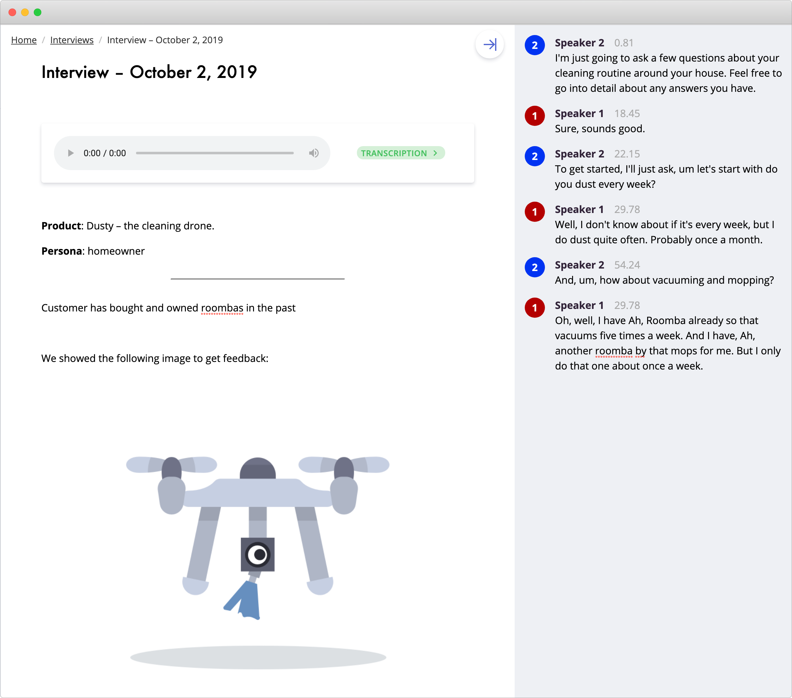
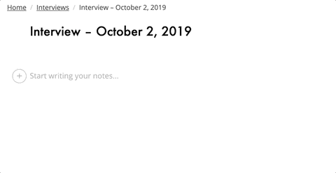
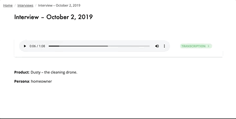
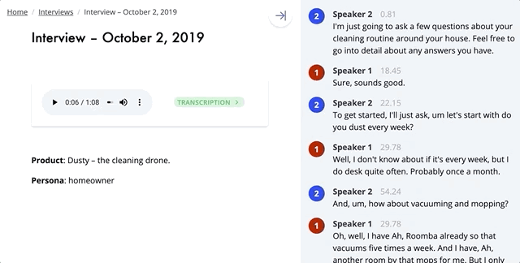
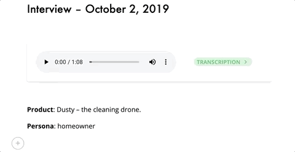
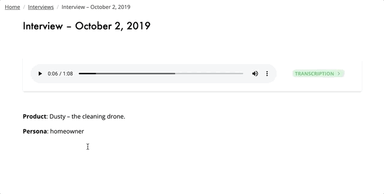

Clarity Hub makes it easy to take notes and capture all of the data from your customer interviews.

Take audio recordings, get transcripts, write rich notes before, during, and after your interviews.

<!-- end -->

Our application is perfect for product managers, UX researchers, and product teams to gather data from their customers and make great product decisions.

## Take Audio Recordings

You can add an audio recording block to any Interview. Record up to two hours at a time.

## Upload Your Own Recordings

Already have recording sessions from another tool? Just drag and drop them in.

## Get Transcripts

We automatically generate transcriptions from any recording taken from within our application.

We will also transcribe any WAV or MP3 files that you upload to an Interview as well.

## Fix Transcription Errors

Sometimes we don't get the transcription perfect. Transcriptions are fully editable – you can fix any text we incorrectly transcribed.

## Play Back Your Recordings

You can listen to any recording that you have captured in your interviews.

## Take Notes

Our editor lets you take rich notes so you can organize your data. Get all the features you are used to in a rich-text editor.

## Add Photos

See something insightful that you want to capture? Take a photo and upload it to your interview. You can also drag and drop photos into your interview.

## Capture Any Media

You can upload any file to an interview. We continue to iterate on our editor and will be adding file previews and more for additional file types. Files that we don't know how to display can still be attached to interviews and downloaded by others on your team.

## Request Access

See how Clarity Hub can help you gather your customer feedback together and make it easier to build products your customers love.
