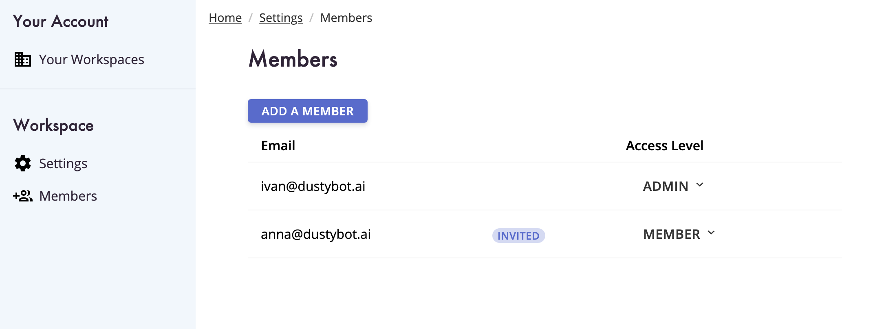
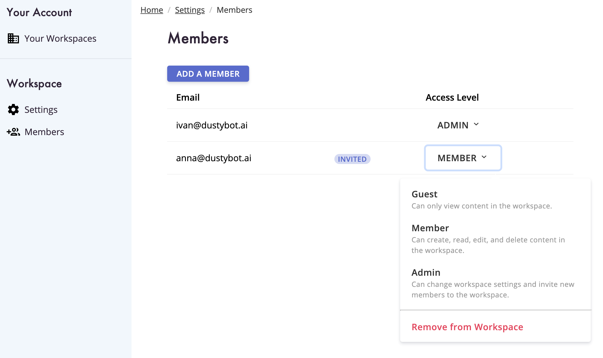
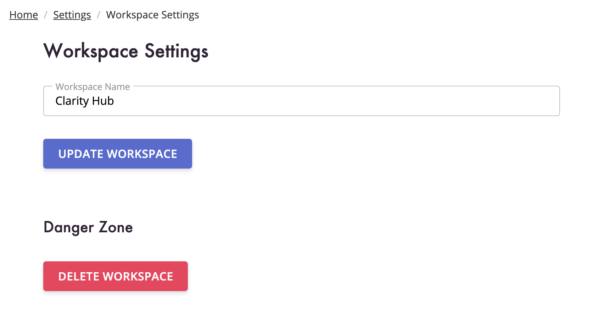
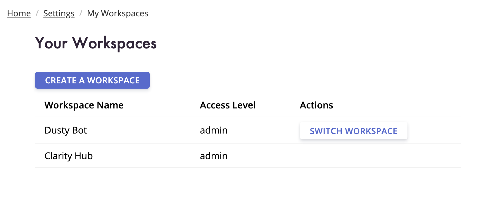

You can manage your account and your workspace in Clarity Hub with our new admin tools.
We've been working to make it easy for you to onboard your entire team onto Clarity Hub so you can share interview notes, recordings, and transcripts with each other.

<!-- end -->

## Invite your team
Get your entire product team onto Clarity Hub. When you invite a team member, we'll send them an email to let them know that they've been invited to join a new workspace.

## Manage permissions

Give users different access to your workspace with different levels of permissions: guest, member, admin. **Guests** can view content in your workspace but can't make changes. **Members** can create, edit, and delete content in the workspace. **Admins** can edit your workspace settings and invite new members.

## Update your workspace name

You can go into your Settings and Members section and edit your workspace information.

## Create multiple workspaces

Have different products you want to keep track of? Or maybe different teams? Perhaps you contract with different companies.
You can manage all of your work in different workspaces.
Simply click "Create a Workspace", give the workspace a name, and you will be able to switch between workspaces at any time.

## Other improvements

There are a few other small quality of life improvements we have added as well:

You can leave a workspace. As long as there would be at least 1 other admin remaining in the workspace, you can leave any workspace you've created or been invited to.

You can remove users from a workspace. If someone has left your team or you invited the wrong email, you can remove any user from a workspace as long as you are an admin.

At any point, you can delete your workspace and we will delete all of your uploaded media and interview data for data privacy.

