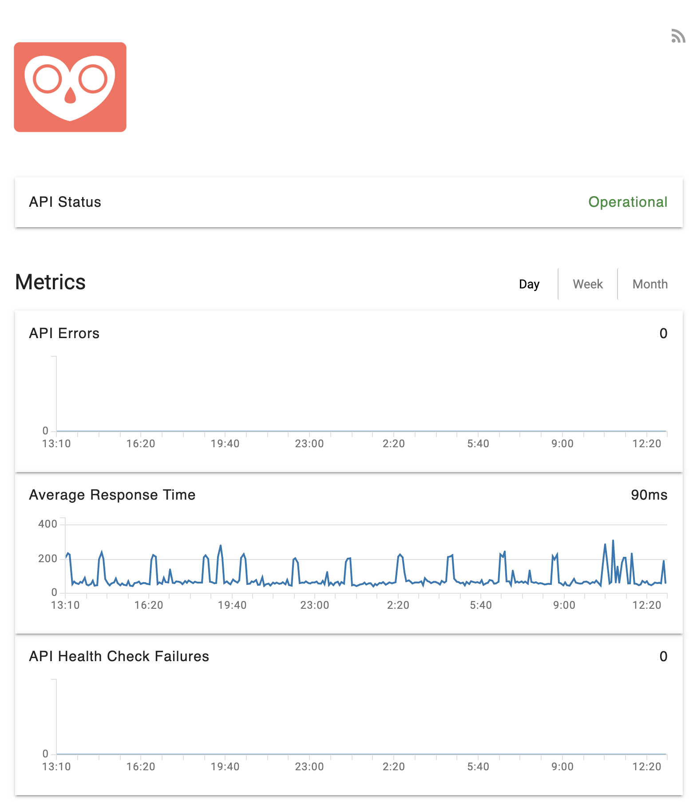
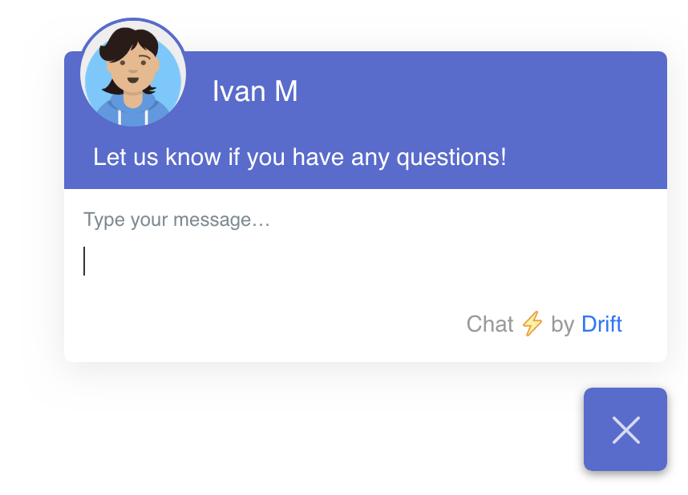

## Status Page

We have released a status page to track the health of our services. This page will help us improve and debug our app while we are in beta, as well as provide transparency for our users. We will post any known incidents here: https://status.clarityhub.io

## In-App Chat

We have added a Drift chat widget to our application. If you have any questions or feedback, you can quickly reach out to our team.

## File Upload Limits

We have added a file upload limit of 500 MiB. You will get an error message if the file is too large.
Recordings are still capped at 2 hours.

## Onboarding

We want to make it easy to onboard onto Clarity Hub. That's why we have added some helpful text to help you onboard when creating your first workspace. 
In addition to this, we have styled a lot of the application to make conducting interviews a more pleasant experience.

## Other improvements

* We added 35 day rolling database recovery, should anything go wrong.
* The sidenav will highlight the current item you are on.
* The editor has been fixed for Mozilla Firefox.
* We fixed loading your workspaces after you have been logged in for a while.
* Fixed audio recordings disappearing when trying to add another one after clicking outside of the editor.
* We improved audio recording file names.
