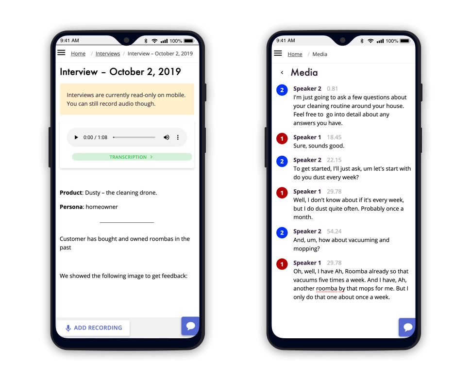

We know that sometimes the best insights don't happen at your desk.

You might be out chatting with a client, or you want to record a customer interview without being too formal.

Our roadmap has plans for native mobile apps for Android and iOS, but until those are released, we wanted to make sure that you can still capture audio recordings on your device.

<!-- end  -->

## Mobile Webapp

We have gone through and made sure that our web application works on mobile devices, and that you can record audio on Google Chrome for Android.

## Interview Notes

Interview notes are read-only on mobile for now, but we have plans to enable rich-text editing on your phone in the future.
While the notes themselves are read-only, you can still add new audio recordings at any time.
