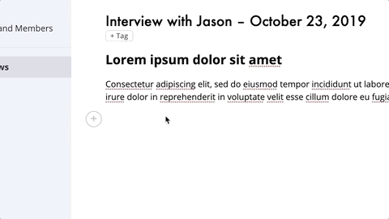
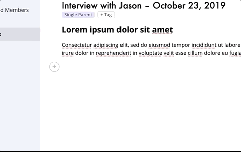
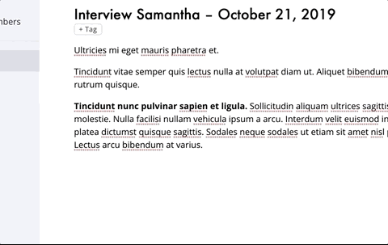
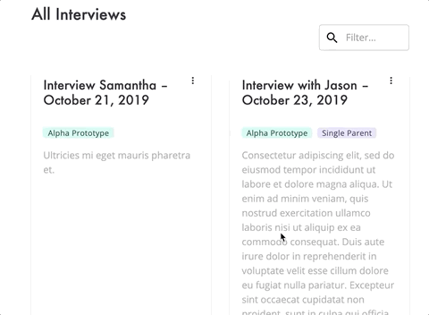
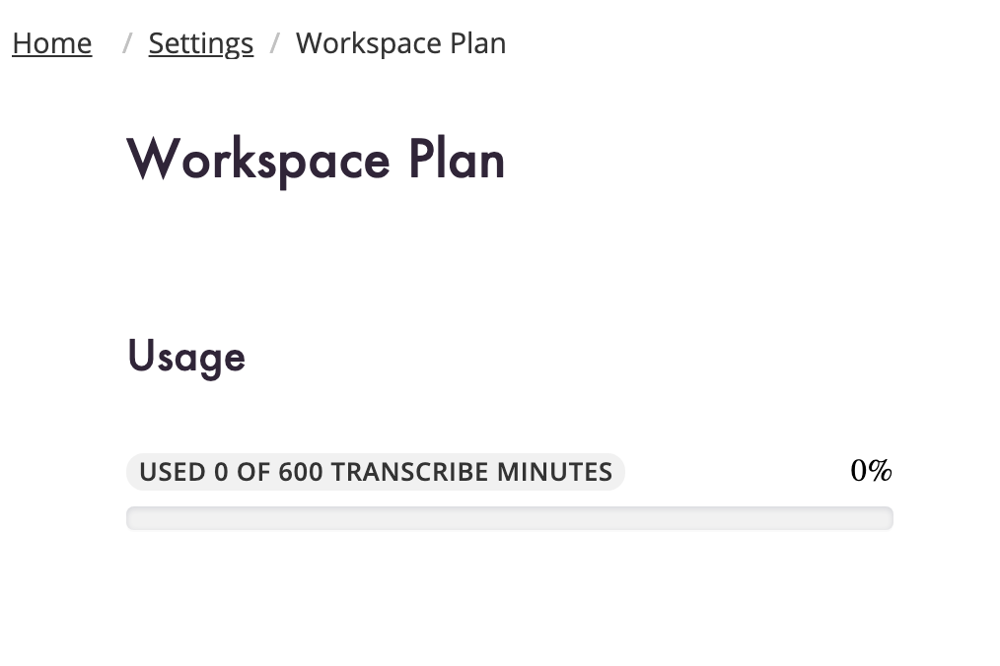

Easily keep your customer interviews organized with our new Tag system. Use tags to keep track of anything from different types of feedback and personas to features and products. You can even add your own custom tags.

<!-- end -->

## Tags

We have added the ability to tag your interviews. All workspaces come with some default categories and tags to help you get started.

### Create tag categories

You can create categories to manage your tags.

### Search your tags

Make it easier to find tags within categories by using the search bar in the tag dropdown.

### Search Your Interviews

Filter interviews by either title or tags

## Additional Changes

### Plan Usage

We added a plans tab to your Settings and Members section of our app. Here you can view your plan limits and how close your are to your limits.

### Bug Fixes

* Switching and creating workspaces now works even if you have been idle for multiple days.
* Added default plan usage if you haven't yet used our transcription services
* Expired refresh tokens now properly log the user out
* Fix recording sometimes causing the timer to flicker and your recording device not being freed.
