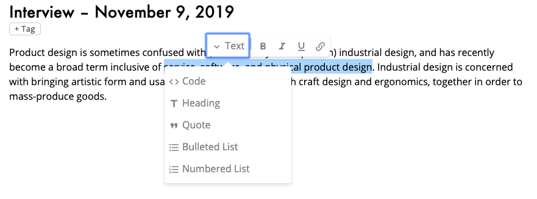
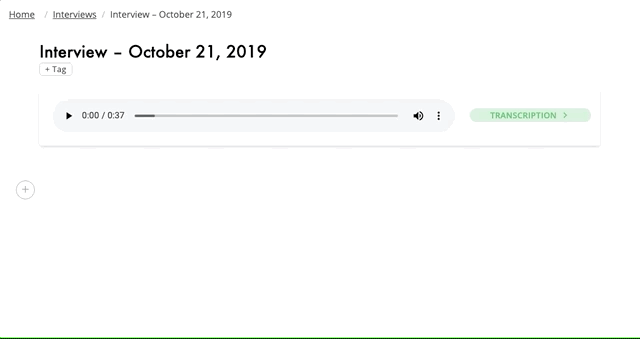

We've improved our editor to make it easier to take notes and work with your team. You can now pull quotes from transcripts into your interview notes, you can download images that you've added to your interview notes, and we've made it easier to write notes using markdown.

<!-- end -->

## New Hover Menu

We have improved the hover menu when selecting text to make it easier to read and group together similar actions.

## Pull Quotes

You can now pull quotes from your transcript right into your interview notes.

## Partial Markdown Support

You can now use an asterisk (*) or a dash (-) then press space to create unordered lists.
You can create numbered lists by typing "1." then press space.
Headings can be quickly created using a number sign (#) then press space.
Similarly, you can create quotes by typing a greater-than sign (>) then press space.

## Download Images

We added a download button to images when you hover over them in the editor.

## Add Links

You can now paste links or turn text into links while editing.
