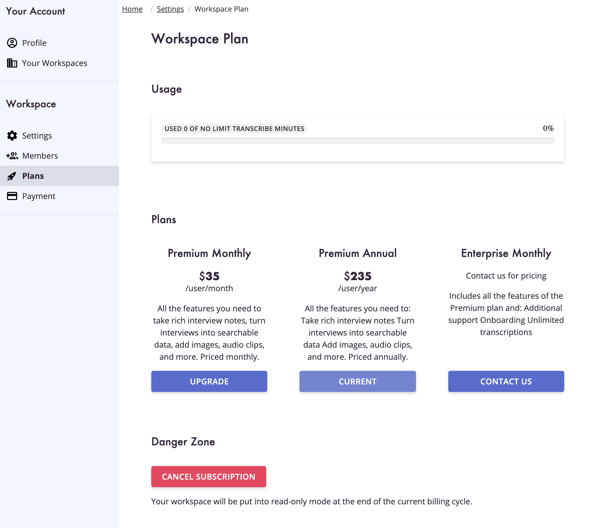

We have added features into our web application to give you the ability to
self-serve: including picking the plan the fits your needs, setting up your
billing details, and viewing your past and upcoming invoices.

<!-- end -->

## Free Trial

Every workspace you create will start with a two week free trial. During this
trial you get access to all the features in Clarity Hub. The only limit is
the number of transcription minutes we provide.

## Plans

You can now pick the plan you want from within the application. Just go to
**Settings and Members -> Plans** to see the available plans and pick the
one you want for your workspace.

## Payments

When picking a plan, you will be able to pay using a credit or debit card.

All payments and sensitive card details are processed by [Stripe](https://stripe.com/).

## Invoices

You can always view past and upcoming invoices by going to **Settings and Members -> Payment**. From here you can change the card you want to use, change billing details
such as what email billing information should be sent to, and view your invoices.

## Build Better Products

Request early access to Clarity Hub and start building better products today!
