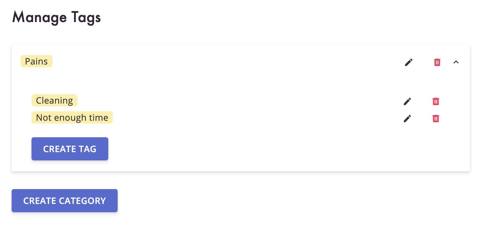
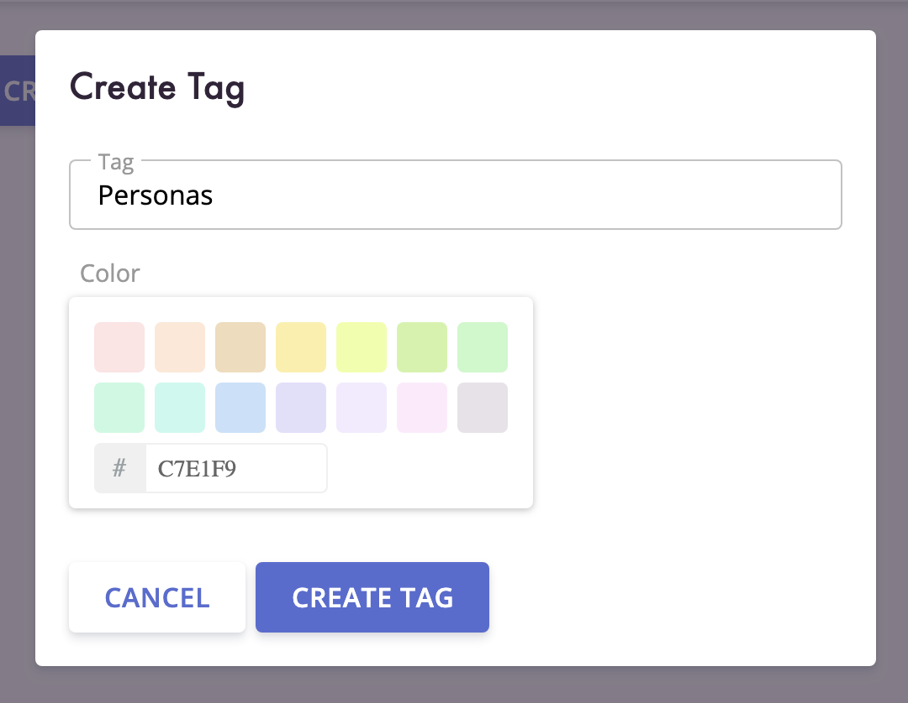
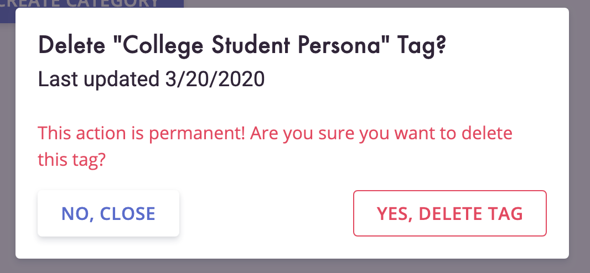

Tags are a core part of Clarity Hub and they help you organize your customer interviews and data.

<!-- end -->

Up until now, you could create categories, tags, and assign text and interviews to those tags and we auto-assigned colors to them for you.

But there wasn't a way to manage your tags.

## Tag Management

We've added a **Tags** navigation item where you can manage your tags. This includes creating, editing, and deleting categories and tags from one place.

### View Tags and Categories

The Tag page lets you view all of the categories and tags that you have created, along with the ones that we auto-create for you when you create your account.

### Create and Update Tags

From the Tag page, you can create new tags and updating existing tags. When creating or updating, you can also change the color using our pre-picked out colors or typing out your own.

### Delete Tags

We added the ability to delete any tag or category as well.

## Build Better Products

Request early access to Clarity Hub and start building better products today!
