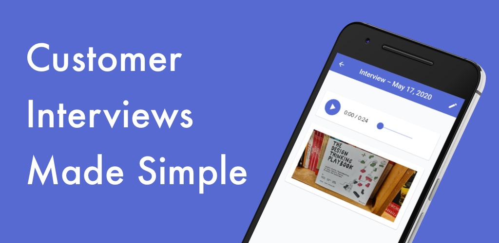

We've released our new Android app for Clarity Hub! You can now record and add photos to interviews from your phone.

<!-- end --->

Our new Android app allows you to create new interviews, record audio – even while you lock your device screen –, and add pictures via your camera or gallery.

## Workspaces

You can login, create, and switch between workspaces all from within the Android application.

## Create Interviews

You can create new interviews from the mobile app and add content to existing interviews as well.

## Audio Recording

When viewing an interview, you can add a new audio recording. Press record and we'll use your device's microphone to start recording your customer interview. Once you're done, you can stop the recording and it will automatically upload to our infrastructure for further processing.

Automatic transcriptions for mobile will be coming soon.

## Add Photos

You can also add photos to your interviews with either your mobile camera, or by uploading them from your existing gallery.

## Get it Today

Download the Clarity Hub Android App today from the Play Store!

[Download from the Play Store](https://play.google.com/store/apps/details?id=clarity.hub&hl=en_US)
