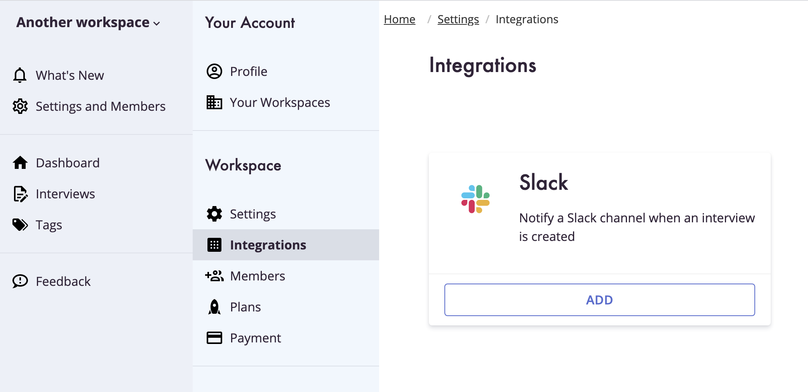

We've introduced integrations into Clarity Hub and our first integration is push to Slack.

<!-- end -->

## Integrations

We've added a new section to the "Setting and Members" section of the Clarity Hub app. The new menu item "Integrations" let's administrators set up new integrations, manage exisitng integrations, and remove any integrations that have been set up for your Workspace.

## Slack Integration

Our first integration is Slack, allowing you to notify a specific channel when new Interviews are created in your Workspace.

## Get Started

You can get started by signing up for our beta, creating a workspace, and adding your first Integration!
