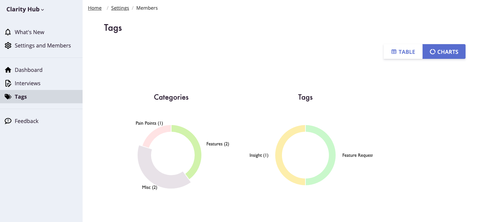

You can now get a pie charts of your tag usage to get a better sense of what categories and tags your customers are talking about.

<!-- end -->

## Pie Charts

We've added a new tab to the "Tags" section of the Clarity Hub app. The new tab allows you to see your tag usage on your interviews.

Once you have tagged your interviews, the new "Charts" tab will show you a pie chart of categories which you can drill into to see a pie chart of tag usage in that category.

We hope this will help you get a better sense of what tags are being most used in your workspace.

