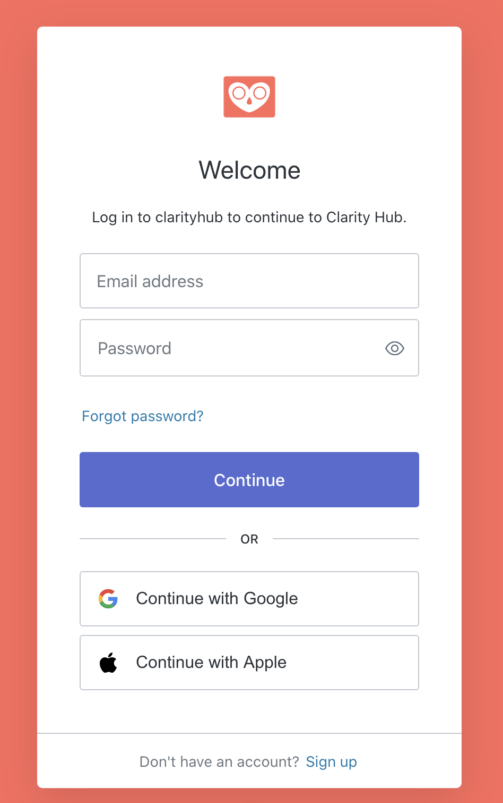

We've enabled "Sign in with Apple" to our OAuth provider. You can now use your Apple ID to log into Clarity Hub, saving you from having to remember another username and password!

<!-- end -->

## Apple Sign In

> Sign in with Apple provides a fast, private way to sign into apps and websites, giving people a consistent experience they can trust and the convenience of not having to remember multiple accounts and passwords.

You can sign in with your existing Apple ID to get access to all of the features Clarity Hub has to offer!
