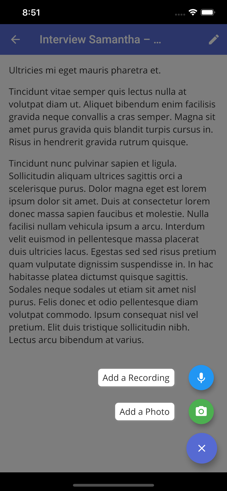

We are excited to announce Clarity Hub for iOS! Download the iOS app to your iPhone and start capturing your customer interviews from your mobile device!

<!-- end --->

<image-left>

Add recordings and photos from your iOS device

</image-left>

## Record from your Phone

Capture customer interviews by recording audio from your iOS device.

Automatic transcriptions for mobile will be coming soon.

## Capture Photos

Need to take a quick picture of something that came up in your customer discovery? Take a photo or upload an image from your gallery to your Clarity Hub notes.

## Manage Multiple Workspaces

You can login, create, and switch between workspaces all from within the iOS app. Once you login, you can access all of your workspaces just like on Desktop. Feel free to switch between different workspaces you have access to on your mobile device.

## Get the App Today

Download the Clarity Hub iOS App today from the Apple Store!

[Download from the Apple Store](https://apps.apple.com/app/id1524186390)
