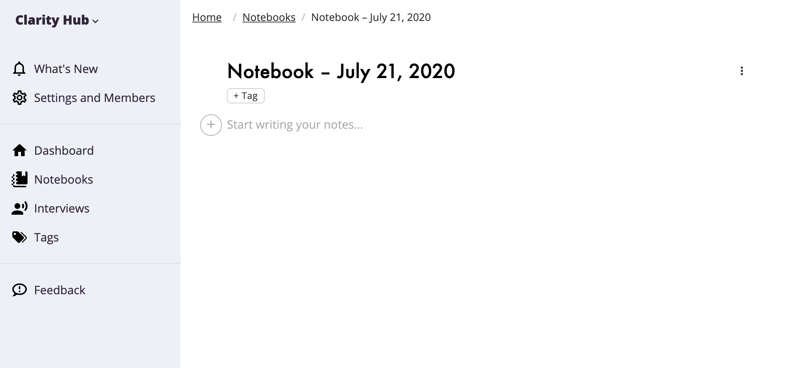
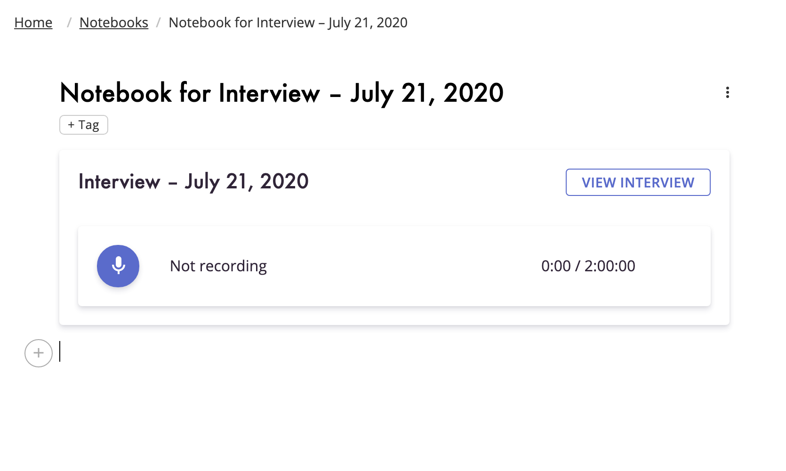
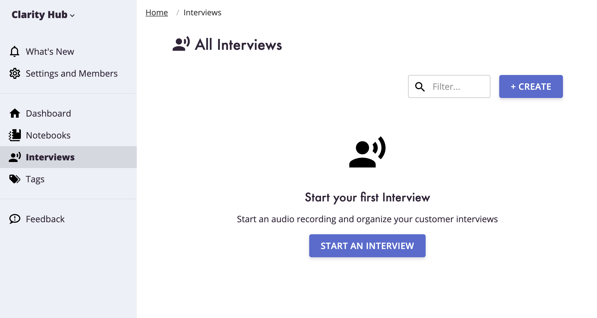

We've introduced a new way to organize your customer interviews and customer discovery notes. Capture your customer interviews in using our Interviews functionality, and take rich notes and synthesize information using Notebooks.

## Notebooks

You can create, edit, and manage Notebooks which let you take rich-text notes.

A Notebook lets you write rich text with heading and links, but it also allows you to embed related information into the Notebook. You can embed Interviews, audio, pictures, and more into a Notebook, making it easy to synthesize related information together in one place.

Instead of adding urls or links, we let you embed information where you want to see it.

## Interviews

We have revamped Interviews to its own section of the Clarity Hub application to make it easier to create, organize, and manage interviews. Plan and structure interviews from within Clarity Hub.

Create a Notebook from directly from your Interview when you need to capture more information.

See what Notebooks reference your Interview as well. 

## Existing Interviews

Existing Interviews in Clarity Hub have been migrated into Notebooks.