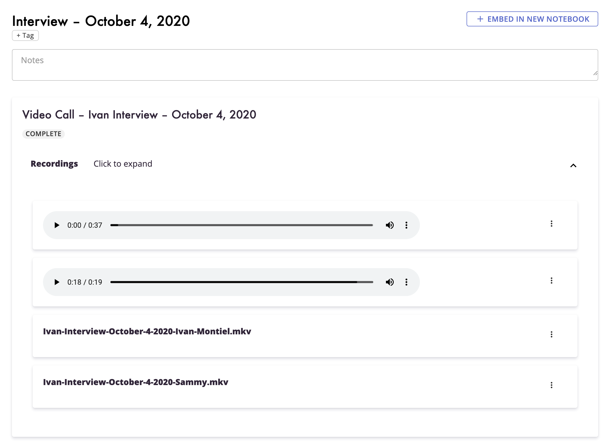

With Video Calls, you can keep all of your scheduled video calls, data, and write ups all in one place. 

## Interviews

Clarity Hub makes it easy to organize your customer discovery data by giving your Notebooks and Interviews. Notebooks let you synthesize information and use rich-text to write your notes and discoveries. Interviews are a way to organize your customer interviews.

From the interview panel in Clarity Hub, you can now create a Video Call interview. This supplements our existing Audio Recording functionality and shares many of the same features:

- You can title your Interview
- Your can add additional notes to the Interview
- Video Call details can be embedded in Notebooks, allowing you to add rich text-notes and synthesize your customer interview learnings

## Video Calls

When setting up a video call you can give your Video Call Room a public name that others will see. This can be different than the name you give the Interview that the Video Call belongs to.

Your Video Call Room is always password protected. You can give your room its own password or use the one we auto-generate for you.

Once a room is created, you can share the magic link with others to allow them to join the room.  A room will not start video sharing until the session is started.

Once a session is started, any number of users from within Clarity Hub can join. You can also continue to share the magic link to allow users to join. When the session starts, users who entered via the magic link will be able to set their name.

Once you've started a video call, you can hide and unhide your video and mute/unmute your audio. We have also added share screen functionality so you can share your screen with others.

Once your session is over, you can close out the video call by clicking End Session from within the Video Call Room, or from the Clarity Hub dashboard. Calls will automatically end after a period of room inactivity – about 10 minutes after everyone has disconnected from the room.

## Bringing it Together

We automatically record your video call so that you have the video and audio files available to you. When participants connect and disconnect, they will produce their own set of audio/video files. These files are available under the "Recordings" section of your Video Call.

All Video Calls can be embedded in Notebooks so that you can write rich-text notes during the interview. You can also embed many different interviews together in one Notebook to synthesize your interviews together.

## Getting Started

Try out Clarity Hub for free by signing up below. Your free trail comes with all the features available in Clarity Hub, including Video Calling.